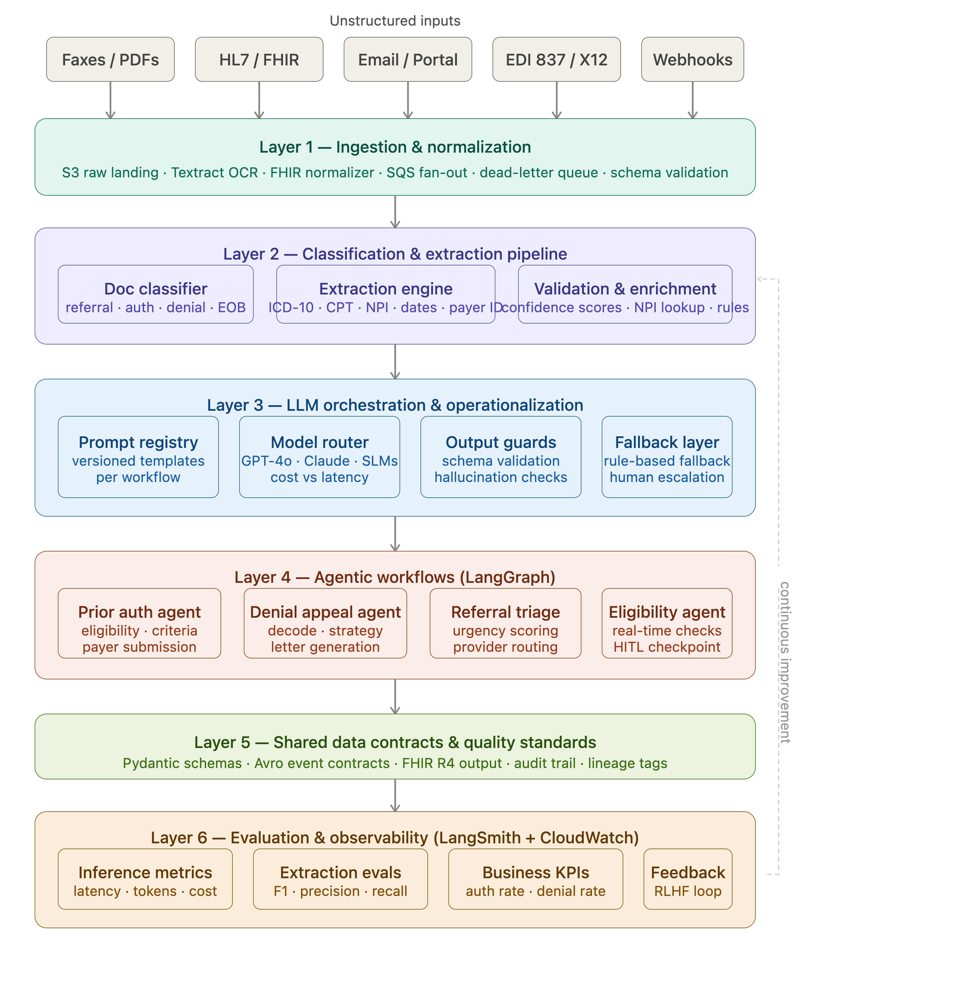
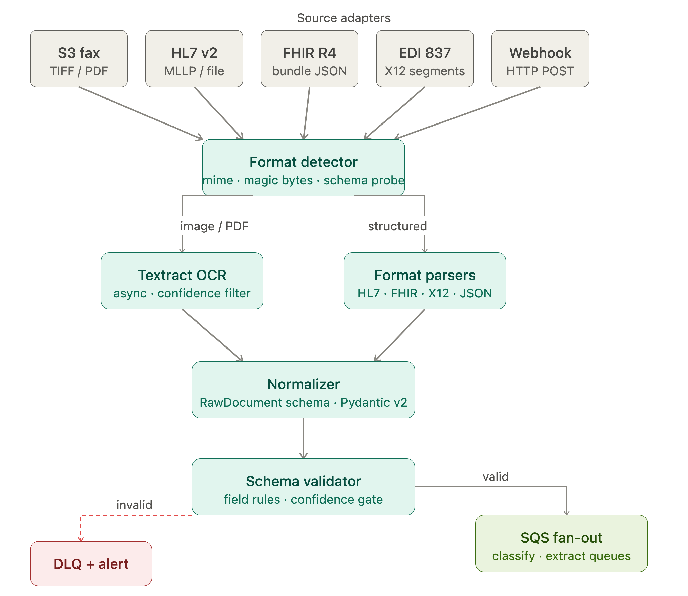
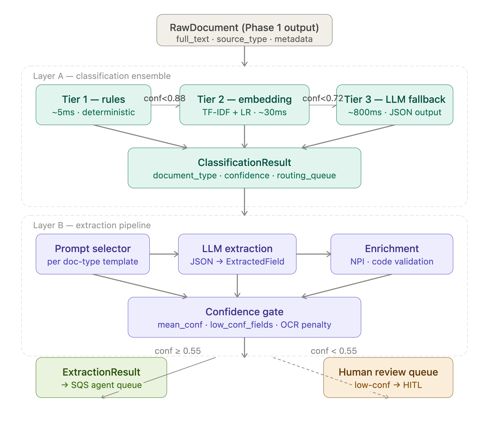

# RCM AI Platform

## Overview
RCM AI Platform is a simulated production grade AI system for healthcare Revenue Cycle Management (RCM). It ingests unstructured inbound documents — faxes, HL7 v2, FHIR R4 bundles, EDI 837 claims, and webhook payloads and turns them into structured, auditable data that drives three high friction RCM workflows: prior authorization, denial appeals, and referral triage. The system is organized as six sequential phases (ingestion → classification/extraction → orchestration → agentic workflows → quality standards → observability), each isolated behind typed Pydantic contracts so no phase depends on another's internals.

## Objective
RCM teams lose significant staff time to manual data entry: reading faxed referrals, rekeying denial letters, cross checking prior auth requirements against payer criteria. The objective of this platform is to remove that manual step without removing human oversight every document flows through deterministic validation and confidence scored extraction before an agent is allowed to act on it, and anything below a confidence threshold is routed to a human-in-the-loop (HITL) queue rather than auto processed. The goal is faster turnaround on prior auth and denial workflows while preserving a full audit trail for compliance review.

## Steps Taken
- **Deterministic ingestion first** — source specific adapters (fax/S3, HL7 v2, FHIR R4, EDI 837, webhook) normalize every input into one canonical RawDocument schema before anything probabilistic touches it; a validator gates malformed documents to a dead letter queue instead of letting them proceed.
- **Confidence-gated classification and extraction** — a three tier classifier (rules → TF-IDF/logistic regression → LLM fallback) assigns a document type, then an LLM extraction engine pulls structured fields (patient, payer, codes, dates) with per field confidence scores, NPI/ICD-10/CPT validation, and OCR penalty adjustment.
- **Cost-aware LLM orchestration** — a model router tiers requests across fast/standard/premium models by task complexity, backed by a versioned prompt registry, output guardrails (PII redaction, schema validation), and a fallback chain (LLM → rules → human queue) so no single provider failure stalls the pipeline.
- **Agentic workflows with HITL gates** — LangGraph style state machines for prior auth, denial appeal, and referral triage each maintain an audit trail and escalate to human review below a confidence threshold rather than auto submitting.
- **Observability and eval built in from the start** — every LLM call records cost, latency, and token usage; an eval pipeline scores extraction F1 against a gold-labeled set so extraction quality is measurable, not assumed.
- **CI/test discipline** — 161 unit tests plus LocalStack-backed integration tests, an 85% coverage gate, ruff/mypy enforcement, and a four stage GitHub Actions pipeline (lint, unit, integration, Docker build) all gating merges to main.

## Expected Outcome
A document entering the system regardless of source format arrives at an agent as a validated, confidence scored, typed object, with low confidence or ambiguous cases automatically deferred to a human rather than silently mis-processed. The expected result is reduced manual rekeying for prior auth and denial workflows, a consistent and auditable decision trail per document (useful for compliance and payer disputes), and a cost/latency profile that scales with document complexity rather than defaulting every call to the most expensive model.

[](https://github.com/rhiriyappa/RCM-AI-Platform/actions/workflows/ci.yml)
[](https://github.com/rhiriyappa/RCM-AI-Platform)
[](https://python.org)

## Architecture
The six layer stack is deliberately sequential until it isn't: ingestion and normalization are purely deterministic (OCR → schema validation → fan-out), classification and extraction introduce probabilistic LLM outputs but gate them through confidence thresholds before anything acts on them, and the agentic layer only fires after structured data is guaranteed upstream. This prevents the most common failure mode in production AI systems - garbage flowing into agents that then make auditable decisions based on it.



### Phase 1: Ingestion and Normalization
The **RawDocument** contract is the most important deliverable in Phase 1. Everything downstream in Phase 2+ consumes it, so getting the schema right before any LLM touches data is the highest-leverage call you make in the whole platform.



### Phase 2: Classificaiton & Extraction Pipeline
The rules engine (classification/rules.py) handles the 60–70% of documents where the signal is unambiguous. A document containing CO-4, RARC, and EOB in the same page is a denial, full stop, and spending 800ms on an LLM call to confirm that is waste. The embedding classifier (classification/embeddings.py) handles the 25% where context matters and "authorization" could appear in a clinical note; the TF-IDF vector catches that the surrounding language is surgical scheduling, not payer correspondence. The LLM fallback (classification/llm_classifier.py) fires for the remaining 5–10% that are genuinely ambiguous: mixed-content documents, unfamiliar payer letter formats, referrals embedded in clinical notes. The cascade costs are 5ms, 30ms, and ~800ms respectively, so only pay for what you need.




## Quick start

```bash
git clone https://github.com/rhiriyappa/RCM-AI-Platform.git
cd RCM_AI-Platform
docker compose up -d
make health
make test
```

## Project structure

```
RCM-AI-Platform/
├── .github/
│   ├── workflows/ci.yml          ← lint + unit + integration (LocalStack) + docker build
│   ├── ISSUE_TEMPLATE/phase_task.md
│   └── pull_request_template.md
├── ingestion/                    ← Phase 1: multi-source document ingestion
│   ├── api.py                    ← FastAPI /health /ingest/{fhir,edi837,webhook}
│   ├── adapters.py               ← FHIRBundle, EDI837, Webhook adapters
│   ├── format_parsers.py         ← HL7 v2 / FHIR R4 / EDI 837 parsers
│   ├── textract_ocr.py           ← AWS Textract OCR with confidence filter
│   ├── normalizer.py             ← → canonical RawDocument
│   ├── validator.py              ← validation + DLQ routing
│   └── sqs_fanout.py             ← FIFO fan-out to classifier + extraction queues
├── classification/                ← Phase 2: 3-tier document classification
│   ├── rules.py                  ← regex/keyword tier (fast path)
│   ├── embeddings.py             ← TF-IDF + logistic regression tier
│   ├── llm_classifier.py         ← LLM fallback tier
│   ├── ensemble.py               ← cascades the three tiers by confidence
│   ├── routing.py                ← DocumentType → SQS queue mapping
│   └── training_data.py          ← labeled training set for the embeddings tier
├── extraction/                    ← Phase 2: LLM structured field extraction
│   ├── engine.py                 ← extraction orchestrator
│   ├── prompts.py                ← versioned per-document-type prompts
│   ├── parser.py                 ← LLM JSON output → ExtractedField
│   ├── enrichment.py             ← NPI lookup + ICD-10/CPT code validation
│   └── confidence.py             ← OCR penalty + completeness scoring
├── orchestration/                 ← Phase 3: LLM orchestration plumbing
│   ├── model_router.py           ← FAST/STANDARD/PREMIUM model tier routing
│   ├── prompt_registry.py        ← versioned prompt template store
│   ├── guardrails.py             ← PII redaction, output validation
│   └── fallback.py               ← LLM → rules → human-queue fallback chain
├── agents/                        ← Phase 4: LangGraph-style agentic workflows
│   ├── base.py                   ← BaseAgent: audit trail, HITL gate, fail state
│   ├── prior_auth.py             ← prior authorization agent
│   ├── denial.py                 ← denial appeal agent
│   └── triage.py                 ← referral triage agent
├── observability/                 ← Phase 5: cost/latency tracking and evals
│   ├── metrics.py                ← per-call cost + latency recording
│   └── eval_pipeline.py          ← F1 scoring against a gold set
├── contracts/schemas.py           ← canonical Pydantic v2 models (RawDocument, ExtractionResult, AgentState, …)
├── infra/
│   ├── db/init.sql               ← Postgres schema
│   ├── localstack/init.sh        ← seeds S3 bucket + SQS queues
│   └── terraform/                ← cloud IaC modules
├── scripts/run_eval.py           ← CLI extraction eval harness
├── tests/                        ← mirrors the package layout; 161 unit + 2 integration tests
│   ├── agents/ · classification/ · extraction/ · ingestion/ · orchestration/
│   ├── fixtures/gold_extractions_p2.jsonl
│   ├── conftest.py
│   └── test_coverage_gaps.py
├── docker-compose.yml            ← LocalStack + Postgres + Redis + ingestor
├── Dockerfile.dev
├── pyproject.toml                ← deps, pytest config, ruff, mypy, coverage
├── Makefile                      ← make up/down/test/lint/eval/health
├── README.md
└── CONTRIBUTING.md
```

## Make targets

| Command | Description |
|---|---|
| `make up` | Start full local stack (LocalStack + Postgres + Redis) |
| `make down` | Stop all services |
| `make test` | Full test suite with coverage gate (≥85%) |
| `make test-p1` | Phase 1 ingestion tests |
| `make test-p2` | Phase 2 classification + extraction tests |
| `make test-p3` | Phase 3 orchestration tests |
| `make test-p4` | Phase 4 agent tests |
| `make lint` | ruff + mypy |
| `make fmt` | Auto-format |
| `make eval` | Run extraction eval harness against gold set |
| `make health` | Check service health endpoints |

## Phase status

| Phase | Scope | Status |
|---|---|---|
| Phase 1 | Ingestion & normalization | ✅ Complete |
| Phase 2 | Classification & extraction | ✅ Complete |
| Phase 3 | LLM orchestration layer | ✅ Complete |
| Phase 4 | Agentic workflow engine | ✅ Complete |
| Phase 5 | Observability & eval | ✅ Complete |

## Tech stack

| Concern | Technology |
|---|---|
| OCR | AWS Textract (async) |
| LLM inference | Claude Sonnet · GPT-4o · vLLM |
| Structured outputs | Instructor + Pydantic v2 |
| Orchestration | LangGraph + LangChain |
| Vector store | pgvector (HNSW) |
| Message bus | SQS FIFO · Kinesis |
| Observability | LangSmith · CloudWatch · Grafana |
| Eval | RAGAS · pytest · gold extraction sets |
| Local dev | LocalStack · Docker Compose |
