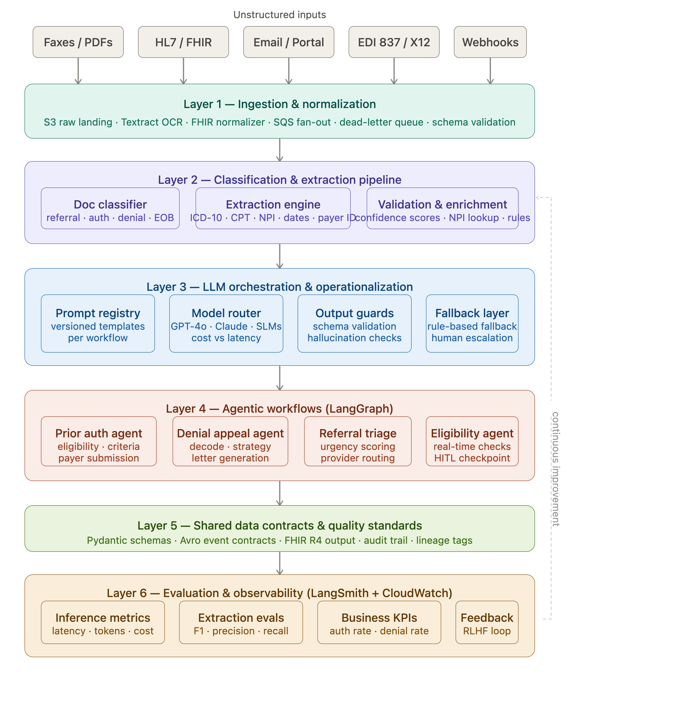
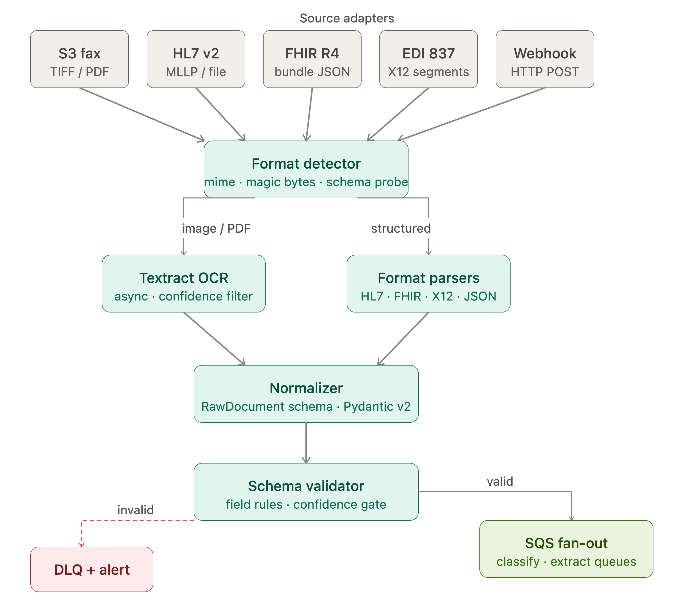
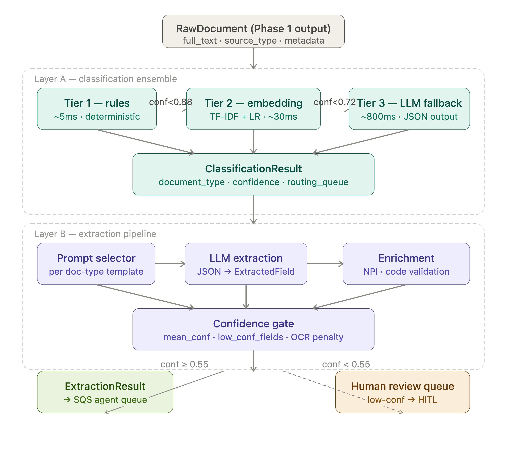
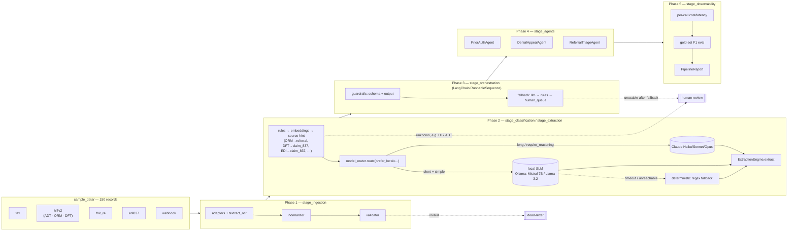

# RCM AI Platform

## Overview
RCM AI Platform is a simulated production grade AI system for healthcare Revenue Cycle Management (RCM). It ingests unstructured inbound documents — faxes, HL7 v2, FHIR R4 bundles, EDI 837 claims, and webhook payloads and turns them into structured, auditable data that drives three high friction RCM workflows: prior authorization, denial appeals, and referral triage. The system is organized as six sequential phases (ingestion → classification/extraction → orchestration → agentic workflows → quality standards → observability), each isolated behind typed Pydantic contracts so no phase depends on another's internals.

## Objective
RCM teams lose significant staff time to manual data entry: reading faxed referrals, rekeying denial letters, cross checking prior auth requirements against payer criteria. The objective of this platform is to remove that manual step without removing human oversight every document flows through deterministic validation and confidence scored extraction before an agent is allowed to act on it, and anything below a confidence threshold is routed to a human-in-the-loop (HITL) queue rather than auto processed. The goal is faster turnaround on prior auth and denial workflows while preserving a full audit trail for compliance review.

## Steps Taken
- **Deterministic ingestion first** — source specific adapters (fax/S3, HL7 v2, FHIR R4, EDI 837, webhook) normalize every input into one canonical RawDocument schema before anything probabilistic touches it; a validator gates malformed documents to a dead letter queue instead of letting them proceed.
- **Confidence-gated classification and extraction** — a three tier classifier (rules → TF-IDF/logistic regression → LLM fallback) assigns a document type, then an LLM extraction engine pulls structured fields (patient, payer, codes, dates) with per field confidence scores, NPI/ICD-10/CPT validation, and OCR penalty adjustment.
- **Cost-aware LLM orchestration** — a model router tiers requests across fast/standard/premium models by task complexity, backed by a versioned prompt registry, output guardrails (PII redaction, schema validation), and a fallback chain (LLM → rules → human queue) so no single provider failure stalls the pipeline.
- **Agentic workflows with HITL gates** — LangGraph style state machines for prior auth, denial appeal, and referral triage each maintain an audit trail and escalate to human review below a confidence threshold rather than auto submitting.
- **Observability and eval built in from the start** — every LLM call records cost, latency, and token usage; an eval pipeline scores extraction F1 against a gold-labeled set so extraction quality is measurable, not assumed.
- **CI/test discipline** — 273 unit tests plus 3 integration tests (2 LocalStack-backed, 1 live-Ollama-backed), an 85% coverage gate, ruff/mypy enforcement, and a four stage GitHub Actions pipeline (lint, unit, integration, Docker build) all gating merges to main.
- **A phased simulation harness over synthetic sample data** (`pipeline/`) — 150 generated records across all five source formats run through every phase end to end, with extraction split between a local SLM (Ollama) for simple documents and escalation to Claude for complex ones, and orchestration expressed as a LangChain Runnable chain. See [Sample-Data Simulation Pipeline](#sample-data-simulation-pipeline) below.

## Expected Outcome
A document entering the system regardless of source format arrives at an agent as a validated, confidence scored, typed object, with low confidence or ambiguous cases automatically deferred to a human rather than silently mis-processed. The expected result is reduced manual rekeying for prior auth and denial workflows, a consistent and auditable decision trail per document (useful for compliance and payer disputes), and a cost/latency profile that scales with document complexity rather than defaulting every call to the most expensive model.

[](https://github.com/rhiriyappa/RCM-AI-Platform/actions/workflows/ci.yml)
[](https://github.com/rhiriyappa/RCM-AI-Platform)
[](https://python.org)

## Architecture
The six layer stack is deliberately sequential until it isn't: ingestion and normalization are purely deterministic (OCR → schema validation → fan-out), classification and extraction introduce probabilistic LLM outputs but gate them through confidence thresholds before anything acts on them, and the agentic layer only fires after structured data is guaranteed upstream. This prevents the most common failure mode in production AI systems - garbage flowing into agents that then make auditable decisions based on it.



### Phase 1: Ingestion and Normalization
The **RawDocument** contract is the most important deliverable in Phase 1. Everything downstream in Phase 2+ consumes it, so getting the schema right before any LLM touches data is the highest-leverage call you make in the whole platform.



### Phase 2: Classificaiton & Extraction Pipeline
The rules engine (classification/rules.py) handles the 60–70% of documents where the signal is unambiguous. A document containing CO-4, RARC, and EOB in the same page is a denial, full stop, and spending 800ms on an LLM call to confirm that is waste. The embedding classifier (classification/embeddings.py) handles the 25% where context matters and "authorization" could appear in a clinical note; the TF-IDF vector catches that the surrounding language is surgical scheduling, not payer correspondence. The LLM fallback (classification/llm_classifier.py) fires for the remaining 5–10% that are genuinely ambiguous: mixed-content documents, unfamiliar payer letter formats, referrals embedded in clinical notes. The cascade costs are 5ms, 30ms, and ~800ms respectively, so only pay for what you need.



## Sample-Data Simulation Pipeline

`pipeline/` is a phased harness that runs synthetic sample data through the real Phase 1–5 modules end to end — the fastest way to see the whole platform work without AWS credentials, a payer sandbox, or a hosted LLM key. It is additive: `ingestion/`, `classification/`, `extraction/`, `orchestration/`, `agents/`, and `observability/` are unchanged and still used directly; `pipeline/` just drives them in order and carries one `PipelineRecord` per document between stages.

```
sample_data/{fax,hl7v2,fhir_r4,edi837,webhook}/   150 fictitious records (50 HL7, 25 each of the rest)
                     │
                     ▼
scripts/generate_sample_data.py   regenerates the fixtures above (deterministic, seeded)
```

### Reference architecture


```mermaid
flowchart LR
    subgraph SRC["sample_data/ — 150 records"]
        FAX[fax]
        HL7["hl7v2<br/>(ADT · ORM · DFT)"]
        FHIR[fhir_r4]
        EDI[edi837]
        WH[webhook]
    end

    subgraph P1["Phase 1 — stage_ingestion"]
        ADPT[adapters + textract_ocr] --> NORM[normalizer] --> VAL[validator]
    end

    subgraph P2["Phase 2 — stage_classification / stage_extraction"]
        CLS["rules → embeddings → source hint<br/>(ORM→referral, DFT→claim_837, EDI→claim_837, …)"]
        CLS --> ROUTE["model_router.route(prefer_local=...)"]
        ROUTE -->|short + simple| SLM[("local SLM<br/>Ollama: Mistral 7B / Llama 3.2")]
        ROUTE -->|long / require_reasoning| HOSTED[("Claude Haiku/Sonnet/Opus")]
        SLM -.->|timeout / unreachable| DET[deterministic regex fallback]
        HOSTED --> EXT[ExtractionEngine.extract]
        SLM --> EXT
        DET --> EXT
    end

    subgraph P3["Phase 3 — stage_orchestration<br/>(LangChain RunnableSequence)"]
        GR[guardrails: schema + output] --> FB["fallback: llm → rules → human_queue"]
    end

    subgraph P4["Phase 4 — stage_agents"]
        PA[PriorAuthAgent]
        DA[DenialAppealAgent]
        RT[ReferralTriageAgent]
    end

    subgraph P5["Phase 5 — stage_observability"]
        MET[per-call cost/latency] --> EVAL[gold-set F1 eval] --> REPORT[PipelineReport]
    end

    SRC --> P1 --> P2 --> P3 --> P4 --> P5
    VAL -.->|invalid| DLQ[[dead-letter]]
    CLS -.->|unknown, e.g. HL7 ADT| HR[[human review]]
    FB -.->|unusable after fallback| HR
```

Every record ends at exactly one of: an agent-completed outcome, an HITL pause, a dead-letter (ingestion rejected it), a human-review queue (unclassifiable, or extraction unusable after the fallback chain), or routed-with-no-agent (classified correctly but that document type has no agent yet, e.g. `claim_837`).

### Running it

```bash
# 1. (Re)generate the 150 sample files — safe to re-run, fully deterministic
make sample-data                      # or: python scripts/generate_sample_data.py

# 2. Run every phase, deterministic extraction (no network, no model required)
make pipeline                         # or: python -m pipeline.runner

# 3. Same run, routed through a local SLM for the simple/short extractions instead
ollama pull llama3.2                  # one-time; or `ollama pull mistral` + RCM_SLM_MODEL=mistral
make pipeline-slm                     # or: python -m pipeline.runner --llm slm

# Useful flags on the runner CLI:
python -m pipeline.runner --source fax --source webhook   # limit to one or more sources
python -m pipeline.runner --until classification          # stop after a given phase
python -m pipeline.runner --out-dir out/                   # one JSONL per phase + report.json
python -m pipeline.runner --no-eval                        # skip the gold-set eval
python -m pipeline.runner -q                                # print only the final JSON report

# 4. Run the pipeline's own test suite (also included in `make test`)
make test-pipeline
# or directly:
PYTHONPATH=$PWD pytest tests/pipeline/ tests/orchestration/test_langchain_chain.py -v

# 5. Everything, including the one live-Ollama test (skips itself if Ollama/the model isn't up)
PYTHONPATH=$PWD pytest tests/ -m integration -k slm_llm -v
```

`RCM_CALL_LLM=slm` (or `build_context(backend="slm")` in code) is equivalent to `--llm slm`; the CLI flag takes precedence. The default backend (`deterministic`) never touches the network, which is what CI and `make test` run against — a `deterministic → slm` switch only changes which `call_llm` implementation the extraction stage uses, nothing else in the pipeline.

| Env var | Default | Purpose |
|---|---|---|
| `RCM_CALL_LLM` | `deterministic` | Backend for `build_context()` when `--llm`/`backend=` isn't passed explicitly: `deterministic` or `slm` |
| `OLLAMA_URL` | `http://localhost:11434` | Where the local Ollama server is listening |
| `RCM_SLM_MODEL` | `llama3.2` | Ollama model tag — swap for `mistral` (Mistral 7B) after `ollama pull mistral` |
| `RCM_SLM_TIMEOUT` | `20` (seconds) | Per-call timeout before falling back to the deterministic extractor |
| `RCM_SLM_NUM_PREDICT` | `500` | Response token cap sent to Ollama, so generation can't run past the timeout budget |

The `slm` backend never hangs the pipeline or a test run: `pipeline/slm_llm.py` catches connection errors, timeouts, and unparseable responses and falls back to the same deterministic extractor the default backend uses, logging a warning each time. `pipeline/offline_llm.py` (deterministic) and `pipeline/slm_llm.py` (SLM, with that same fallback) are both "offline-safe" call_llm implementations in that sense — neither can fail a test run for lack of a model or an API key.

### HL7 message types: ADT, ORM, DFT

`sample_data/hl7v2/` ships 50 samples (not 25, like the other sources) split evenly across three HL7 v2 message types, because classification maps each one differently (`classification` picks this up from the MSH-9 field, see `pipeline/stage_classification.py`):

| Message type | Meaning | Maps to | Why |
|---|---|---|---|
| `ADT^A08` | Patient registration/demographics update | *(none — falls through to human review)* | Not an RCM workflow this platform models; there's no `DocumentType` for it by design |
| `ORM^O01` | Order message (e.g. a specialist order) | `DocumentType.REFERRAL` | An outbound order is functionally a referral |
| `DFT^P03` | Post detail financial transaction (a charge post) | `DocumentType.CLAIM_837` | A charge post is a claim event |

`tests/pipeline/test_hl7_message_types.py` runs all 50 real samples through ingestion and classification and asserts each message type lands where this table says — not just a hand-written single-message example, so a regression in either mapping (or in the generator producing only one message type again) fails a test.

## Quick start

```bash
git clone https://github.com/rhiriyappa/RCM-AI-Platform.git
cd RCM_AI-Platform
docker compose up -d
make health
make test
```

## Project structure

```
RCM-AI-Platform/
├── .github/
│   ├── workflows/ci.yml          ← lint + unit + integration (LocalStack) + docker build
│   ├── ISSUE_TEMPLATE/phase_task.md
│   └── pull_request_template.md
├── ingestion/                    ← Phase 1: multi-source document ingestion
│   ├── api.py                    ← FastAPI /health /ingest/{fhir,edi837,webhook}
│   ├── adapters.py               ← FHIRBundle, EDI837, Webhook adapters
│   ├── format_parsers.py         ← HL7 v2 / FHIR R4 / EDI 837 parsers
│   ├── textract_ocr.py           ← AWS Textract OCR with confidence filter
│   ├── normalizer.py             ← → canonical RawDocument
│   ├── validator.py              ← validation + DLQ routing
│   └── sqs_fanout.py             ← FIFO fan-out to classifier + extraction queues
├── classification/                ← Phase 2: 3-tier document classification
│   ├── rules.py                  ← regex/keyword tier (fast path)
│   ├── embeddings.py             ← TF-IDF + logistic regression tier
│   ├── llm_classifier.py         ← LLM fallback tier
│   ├── ensemble.py               ← cascades the three tiers by confidence
│   ├── routing.py                ← DocumentType → SQS queue mapping
│   └── training_data.py          ← labeled training set for the embeddings tier
├── extraction/                    ← Phase 2: LLM structured field extraction
│   ├── engine.py                 ← extraction orchestrator
│   ├── prompts.py                ← versioned per-document-type prompts
│   ├── parser.py                 ← LLM JSON output → ExtractedField
│   ├── enrichment.py             ← NPI lookup + ICD-10/CPT code validation
│   └── confidence.py             ← OCR penalty + completeness scoring
├── orchestration/                 ← Phase 3: LLM orchestration plumbing
│   ├── model_router.py           ← FAST/STANDARD/PREMIUM/LOCAL_SLM model tier routing
│   ├── prompt_registry.py        ← versioned prompt template store
│   ├── guardrails.py             ← PII redaction, output validation
│   ├── fallback.py               ← LLM → rules → human-queue fallback chain
│   └── langchain_chain.py        ← guardrails + fallback as a LangChain Runnable chain
├── agents/                        ← Phase 4: LangGraph-style agentic workflows
│   ├── base.py                   ← BaseAgent: audit trail, HITL gate, fail state
│   ├── prior_auth.py             ← prior authorization agent
│   ├── denial.py                 ← denial appeal agent
│   └── triage.py                 ← referral triage agent
├── observability/                 ← Phase 5: cost/latency tracking and evals
│   ├── metrics.py                ← per-call cost + latency recording
│   └── eval_pipeline.py          ← F1 scoring against a gold set
├── pipeline/                      ← sample-data simulation harness, drives Phases 1–5 in order
│   ├── context.py                ← PipelineContext: wires up every phase's components, picks call_llm
│   ├── offline_llm.py            ← deterministic (regex) call_llm — default, no network required
│   ├── slm_llm.py                ← Ollama-backed call_llm (Mistral 7B / Llama); falls back to offline_llm
│   ├── stage_ingestion.py        ← Phase 1
│   ├── stage_classification.py   ← Phase 2a (+ source-declared-type hints: EDI/FHIR/HL7 ORM·DFT/webhook)
│   ├── stage_extraction.py       ← Phase 2b
│   ├── stage_orchestration.py    ← Phase 3 (via orchestration/langchain_chain.py)
│   ├── stage_agents.py           ← Phase 4
│   ├── stage_observability.py    ← Phase 5
│   └── runner.py                 ← CLI: `python -m pipeline.runner`
├── contracts/
│   ├── schemas.py                ← canonical Pydantic v2 models (RawDocument, ExtractionResult, AgentState, …)
│   └── pipeline.py               ← PipelineRecord / PipelineReport / Disposition for the harness above
├── sample_data/                   ← 150 generated fixtures: fax·hl7v2(×50)·fhir_r4·edi837·webhook
├── infra/
│   ├── db/init.sql               ← Postgres schema
│   ├── localstack/init.sh        ← seeds S3 bucket + SQS queues
│   └── terraform/                ← cloud IaC modules
├── scripts/
│   ├── run_eval.py               ← CLI extraction eval harness
│   ├── generate_sample_data.py   ← (re)generates sample_data/, deterministic
│   └── run_ingestion_sim.py      ← standalone Phase 1-only ingestion/normalization smoke test
├── tests/                        ← mirrors the package layout; 273 unit + 3 integration tests
│   ├── agents/ · classification/ · extraction/ · ingestion/ · orchestration/
│   ├── pipeline/                 ← tests for the harness above, incl. test_hl7_message_types.py
│   ├── fixtures/gold_extractions_p2.jsonl
│   ├── conftest.py
│   └── test_coverage_gaps.py
├── docker-compose.yml            ← LocalStack + Postgres + Redis + ingestor
├── Dockerfile.dev
├── pyproject.toml                ← deps, pytest config, ruff, mypy, coverage
├── Makefile                      ← make up/down/test/lint/eval/health/pipeline
├── README.md
└── CONTRIBUTING.md
```

## Make targets

| Command | Description |
|---|---|
| `make up` | Start full local stack (LocalStack + Postgres + Redis) |
| `make down` | Stop all services |
| `make test` | Full test suite with coverage gate (≥85%) |
| `make test-p1` | Phase 1 ingestion tests |
| `make test-p2` | Phase 2 classification + extraction tests |
| `make test-p3` | Phase 3 orchestration tests |
| `make test-p4` | Phase 4 agent tests |
| `make test-pipeline` | Sample-data simulation pipeline tests (see [Sample-Data Simulation Pipeline](#sample-data-simulation-pipeline)) |
| `make sample-data` | Regenerate the 150 synthetic sample files in `sample_data/` |
| `make pipeline` | Run the sample-data pipeline end to end, deterministic extraction |
| `make pipeline-slm` | Same, routed through a local Ollama SLM for simple extractions |
| `make lint` | ruff + mypy |
| `make fmt` | Auto-format |
| `make eval` | Run extraction eval harness against gold set |
| `make health` | Check service health endpoints |

## Phase status

| Phase | Scope | Status |
|---|---|---|
| Phase 1 | Ingestion & normalization | ✅ Complete |
| Phase 2 | Classification & extraction | ✅ Complete |
| Phase 3 | LLM orchestration layer | ✅ Complete |
| Phase 4 | Agentic workflow engine | ✅ Complete |
| Phase 5 | Observability & eval | ✅ Complete |

## Tech stack

| Concern | Technology |
|---|---|
| OCR | AWS Textract (async) |
| LLM inference | Claude Sonnet/Opus/Haiku (hosted, complex/long) · local SLM via Ollama — Mistral 7B / Llama 3.2 (simple/short, `pipeline/slm_llm.py`) · GPT-4o · vLLM |
| Structured outputs | Instructor + Pydantic v2 |
| Orchestration | LangChain (`orchestration/langchain_chain.py` — Runnable chain) + LangGraph (agent state machines) |
| Vector store | pgvector (HNSW) |
| Message bus | SQS FIFO · Kinesis |
| Observability | LangSmith · CloudWatch · Grafana |
| Eval | RAGAS · pytest · gold extraction sets |
| Local dev | LocalStack · Docker Compose |
